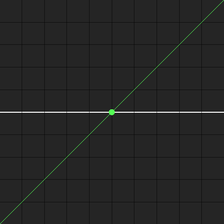
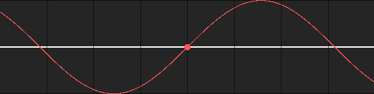

gd.graph
========

.. image:: https://img.shields.io/pypi/l/gd.graph.svg
    :target: https://opensource.org/licenses/MIT
    :alt: Project License

.. image:: https://img.shields.io/pypi/v/gd.graph.svg
    :target: https://pypi.python.org/pypi/gd.graph
    :alt: PyPI Library Version

.. image:: https://img.shields.io/pypi/pyversions/gd.graph.svg
    :target: https://pypi.python.org/pypi/gd.graph
    :alt: Required Python Versions

.. image:: https://img.shields.io/pypi/status/gd.graph.svg
    :target: https://github.com/NeKitDS/gd.graph
    :alt: Project Development Status

.. image:: https://img.shields.io/pypi/dm/gd.graph.svg
    :target: https://pypi.python.org/pypi/gd.graph
    :alt: Library Downloads/Month

.. image:: https://img.shields.io/endpoint.svg?url=https%3A%2F%2Fshieldsio-patreon.herokuapp.com%2Fnekit%2Fpledges
    :target: https://patreon.com/nekit
    :alt: Patreon Page [Support]

gd.graph is a library that implements a CLI for plotting graphs in Geometry Dash.

Installing
----------

**Python 3.6 or higher is required**

To install the library, you can just run the following command:

.. code:: sh

    # Linux/OS X
    python3 -m pip install -U gd.graph

    # Windows
    py -3 -m pip install -U gd.graph

In order to install the library from source, you can do the following:

.. code:: sh

    $ git clone https://github.com/NeKitDS/gd.graph
    $ cd gd.graph
    $ python -m pip install -U .

Invoking
--------

You can invoke the command either like this:

.. code:: sh

    $ python -m gd.graph

Or like this:

.. code:: sh

    $ gd.graph

Quick example
-------------

Here is an example of plotting ``y = x`` function:

.. code:: sh

    $ gd.graph --color=0x55FF55 --func=x --level-name=identity --y-limit=5 --inclusive

.. code:: text

    Preparing database and levels...
    Preparing the level and the editor...
    Free color ID: 1.
    Generating points...
    Generating points to be skipped...
    Applying Ramer-Douglas-Peucker (RDP) algorithm...
    Generating objects...
    Shifting objects to the right...
    Saving...
    Done. Objects used: 286.

And here is the result we get:

Or something more complex, ``y = sin(x)``:

.. code:: sh

    $ gd.graph --color=0xFF5555 --func=sin(x) --level-name="sine wave" --inclusive

.. code:: text

    Preparing database and levels...
    Preparing the level and the editor...
    Free color ID: 1.
    Generating points...
    Generating points to be skipped...
    Applying Ramer-Douglas-Peucker (RDP) algorithm...
    Generating objects...
    Shifting objects to the right...
    Saving...
    Done. Objects used: 548.

And the result:

Command Line Interface
----------------------

Here are all parameters ``gd.graph`` currently accepts:

.. code:: sh

    $ gd.graph --help

.. code:: text

    Usage: gd.graph [OPTIONS]

    Options:
      -color, -c, --color TEXT        Color to use, written in hex format.
      -func, -f, --func TEXT          Mathematical function to graph, like sin(x).
      -level-name, -l, --level-name TEXT
                                      Name of the level to save graph to.
      -start, --start FLOAT           Value of the argument to start plotting
                                      from.

      -stop, --stop FLOAT             Value of the argument to stop plotting at.
      -step, --step FLOAT             Value of the step to add to the argument.
      -y-limit, -y, --y-limit FLOAT   Limit of absolute y value of any point.
      -epsilon, -e, --epsilon FLOAT   Epsilon to use for decimating function a
                                      curve to a similar curve with fewer points.

      -scale, -s, --scale FLOAT       Scale constant used to enlarge the graph.
      -rounding, -r, --rounding INTEGER
                                      Number of decimal places to round each
                                      argument to.

      -inclusive, -i, --inclusive     Whether last argument in given range should
                                      be included.

      --help                          Show this message and exit.

Authors
-------

This project is mainly developed by `NeKitDS <https://github.com/NeKitDS>`_.
